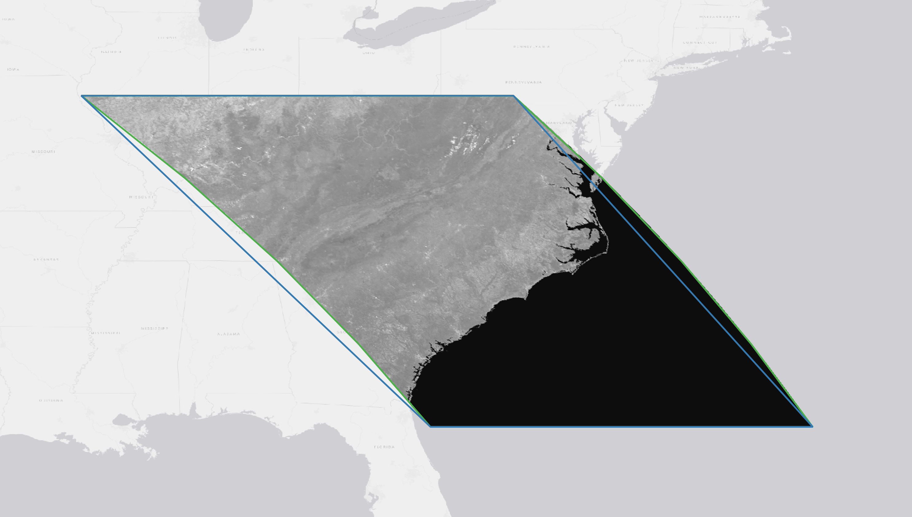

# Reproject a Polygon with Bounded Error

## Fair Warning
This repo is a mix of something useful and a testbed for 'trying stuff out'.

## Summary

The STAC Item geometry field contains a polygon (or multi-polygon) that traces the outline of the Item asset data in WGS84 lon/lat coordinates. However, the asset data is usually in a projected CRS (i.e., not WGS84), so the polygon defining the data outline in the source CRS must be reprojected to WGS84. For high distortion projections, e.g., the sinusoidal projection used by MODIS and VIIRS, the reprojected polygon can stray far from the reprojected data. 

This can be addressed by inserting additional vertices into a polygon prior to reprojection. In the example below, the blue line is the projected original geometry (which was just four coordinates, one on each corner) and the green line is the projected geometry after densifying the original geometry with 12 additional vertices.



Unfortunately, densification is a trial and error process that depends on local projection distortion and the amount of "error", i.e., how far the polygon edges can stray from the edge of the projected raster data, that is acceptable. For zero error, you can create a polygon that follows the edges of each pixel in the reprojected data. But this produces a huge coordinate list in the polygon, which is not efficient for storage or analysis.

An ideal polygon will have the minimum number of vertices necessary to achieve a user-defined error threshold (a.k.a. tolerance). This project demonstrates one way to achieve this:
1. Use the given tolerance (which is defined in the destination CRS linear unit) to create a very dense polygon in the source CRS.
2. Reproject this very dense polygon from the source CRS to the desired destination CRS.
3. Simplify the very dense projected polygon by removing vertices until the error between the simplified polygon and very dense polygon reaches the given tolerance. This last step is just a call to [shapely](https://shapely.readthedocs.io/en/stable/manual.html)'s `simplify` method.

In its current form, a user needs to provide:
1. A GeoJSON-like dictionary containg a polygon or multipolygon with coordinates in the source CRS
2. A string defining the source CRS, e.g., "EPSG:32619"
3. A string defining the destination CRS
4. A maximum allowable error (tolerance) of the polygon in the destination CRS. This actually optional. If not provided, a reprojected polygon is returned without any densification.

The last requirement is not necessarily intuitive when the destination CRS is geographic, i.e, the units are degrees lon/lat. An option to provide the maximum allowable error in meters, regardless of the destination CRS, may be developed if there is interest. Note also that this project will project polygons or multipolygons to/from any CRS. The destination CRS does not need to be WGS84 (EPSG:4326).

A final thought on the use of a GeoJSON-like dictionary for input. It is recognized that this is a bit non-sensical. Coordinates in GeoJSON are, according to the [specification](https://datatracker.ietf.org/doc/html/rfc7946), to be in lon/lat. But the methods in this project will accept and/or produce GeoJSON-like dictionaries with coordinates in projected CRS units, e.g., in meters or feet. So a change to just coordinate lists for input/output may be in the offing.

## Installation

```shell
pip install .
```

## Documentation

See the [documentation page](https://reproject-geometry.readthedocs.io/en/latest/index.html) for the latest docs.

## Command Line

```shell
$ reproject-geometry <json file> <source crs> <destination crs> <options>
```

**Options:**
- `--tolerance` (`-t`): If no tolerance is passed, a reprojected polygon is returned without any densification
- `--precision` (`-p`): Number of decimal places in the reprojected coordinates
- `--outfile` (`-o`): File path to reprojected GeoJSON.

**Example:**
```shell
$ reproject-geometry tests/data-files/HLS.S30.T19LDD.2022166T144741.v2.0.B09_epsg_32619.json "EPSG:32619" "EPSG:4326" -p 5 -t 0.0001 -o test.json
```

## Contributing

We use [pre-commit](https://pre-commit.com/) to check any changes.
To set up your development environment:

```shell
$ pip install -e .
$ pip install -r requirements-dev.txt
$ pre-commit install
```

To check all files:

```shell
$ pre-commit run --all-files
```

To run the tests:

```shell
$ pytest
```

To view test coverage:

```shell
$ pytest --cov=reproject tests
```