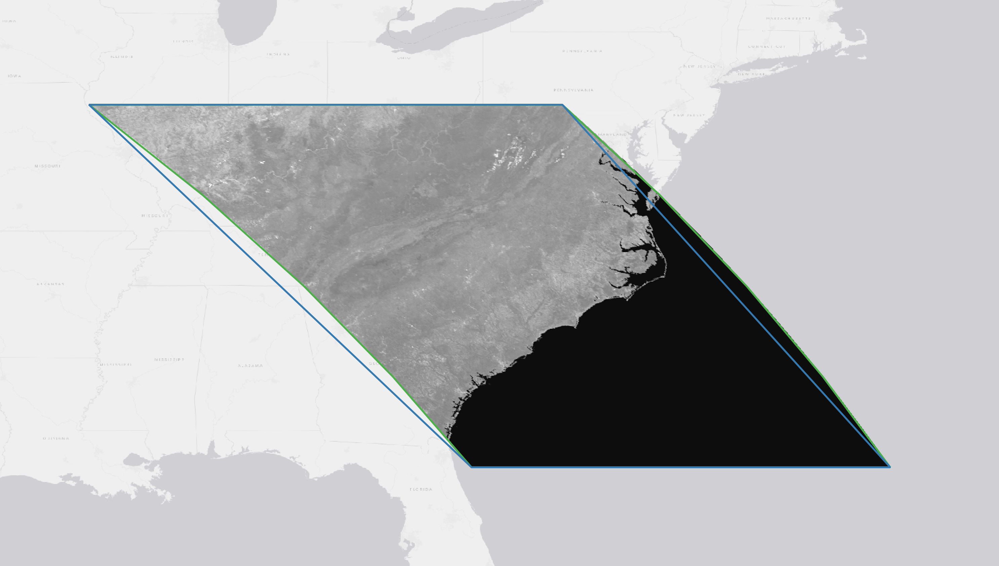

# Reproject a GeoJSON Polygon with Bounded Error

STAC geometries, which trace the outline of source data, are in WGS84 (EPSG: 4326). However, source data is often in a projected system. Large differences can exist between the actual boundary of the source data and the corresponding geometry when both are reprojected to WGS84. This can be addressed by densifying the geometry prior to reprojection. In the example below, the blue line is the projected geometry, the green line is the projected geometry after densifying the geometry with additional vertices.



Densification is a trial and error process that depends on the local projection distortion. This repo demonstrates a (rather brutish) method for generating a reprojected geometry that does not exceed a "maximum error" (a.k.a. tolerance) defined by the user between the source data and geometry in a destination (reprojected) coordinate reference system. 

Essentially, it asks the user to supply the maximum tolerable error rather than guessing at the number of densification points that will produce said maximum tolerable error.

Not intended for use cases where the source data geometry is not yet created - there are better (or at least less complicated) ways to do this in that case.

## Installation

```shell
pip install .
```

## Command-line Usage

Description of the command line functions

```shell
$ reproject <json file> <sourc crs> <destination crs> <destination tolerance>
```

Use `reproject --help` to see all options